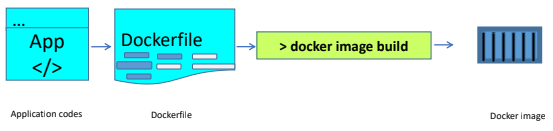
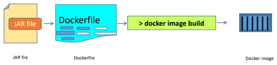
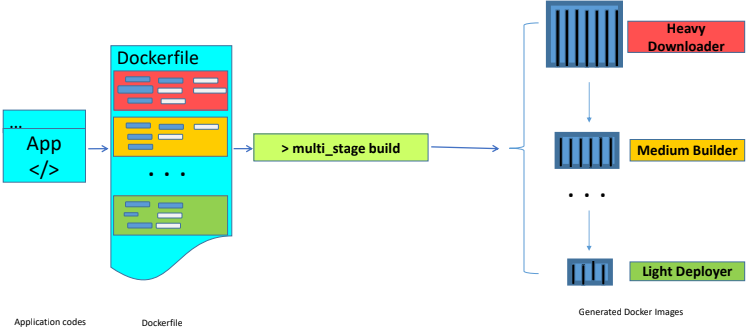

# building-docker-images
In this repository you will find three ways used to build docker images

# Three ways to build Docker Images
This repository holds files which have been used to describe three ways of building Docker images.

# The 3 ways are the following:

# 1. Building Docker image with a normal build
 

To build the docker image with normal build, follow below steps: 

Step 1: Clone the project and access “normal-build” directory \
$ git clone https://github.com/ndekwe/buildingDockerImages.git \
$ cd normal-build/

Step 2: Build the Dockerfile using the following command: \
$ docker image build -t web-server-docker-image . \
The image has built successfully: \
$ docker image ls | grep web-server-docker-image \
web-server-docker-image            latest               195d2421a637        57 seconds ago      643MB 

To run the web server container from the created image: \
$ docker run -p 127.0.0.1:80:8089 web-server-docker-image:latest 

Checking running containers: \
$ docker container ls \
To access the web server, you can run URL http://localhost/ or http://127.0.0.1/ in the browser. 

# 2. Building Docker image from a jar file

# 3. Building Docker image with multi-stages build

# Usage
- For normal build check the Dockerfile under "building-docker-images/normal-build/"
- For multi-stages build check files under "building-docker-images/multi-stage-build/"
- Use files under "building-docker-images/buildFromPackage/" to build from a jar file

